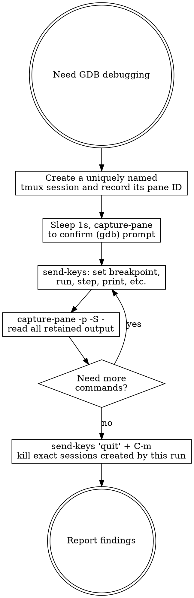

# Interactive GDB Debugging via tmux

## Overview

Use tmux to drive GDB interactively from a non-interactive shell. Keep GDB in a
detached terminal, send commands with `send-keys`, and read each result with
`capture-pane`. For this adaptive workflow, do not use `-batch`, `-ex`, piped
input, or `pexpect`.

## Quick Reference

| Operation | Command |
|-----------|---------|
| Start GDB in tmux | `tmux new-session -d -P -F '#{pane_id}' -s "$GDB_SESSION" 'gdb [args]'` |
| Send GDB command | `tmux send-keys -t "$GDB_PANE" 'command' C-m` |
| Read complete retained output | `tmux capture-pane -p -S - -t "$GDB_PANE"` |
| Log output beyond scrollback | `tmux pipe-pane -O -t "$GDB_PANE" "$PIPE_COMMAND"` |
| Kill the created session | `tmux kill-session -t "=$GDB_SESSION"` |

## Workflow



### 1. Launch GDB in tmux

Generate a per-run name and record both the session name and pane ID printed by
the launch call. Shell variables may not persist between agent tool calls, so
copy the printed literal values into each later call. Never fall back to a
generic name such as `gdb`.

```bash
# Generate a fresh name once for this debugging run.
RUN_ID="$(date -u +%Y%m%dT%H%M%SZ)-$$"
GDB_SESSION="gdb-$RUN_ID"

# Refuse a collision instead of attaching to an existing session.
if tmux has-session -t "=$GDB_SESSION" 2>/dev/null; then
    printf 'tmux session already exists: %s\n' "$GDB_SESSION" >&2
    exit 1
fi

# Local binary. Record the pane ID only if new-session succeeds.
GDB_PANE="$(tmux new-session -d -P -F '#{pane_id}' \
    -s "$GDB_SESSION" 'gdb /path/to/binary')" || exit 1
printf 'GDB_SESSION=%s\nGDB_PANE=%s\n' "$GDB_SESSION" "$GDB_PANE"
```

Use the same launch pattern with the appropriate debugger command:

```bash
# QEMU gdbstub (start QEMU first, then GDB)
# Prefer gdb-multiarch over target-specific GDB (may lack expat/XML support)
GDB_PANE="$(tmux new-session -d -P -F '#{pane_id}' \
    -s "$GDB_SESSION" 'gdb-multiarch /path/to/elf')" || exit 1

# With specific GDB variant
GDB_PANE="$(tmux new-session -d -P -F '#{pane_id}' \
    -s "$GDB_SESSION" '<arch>-<vendor>-<abi>-gdb /path/to/binary')" || exit 1
```

**GDB variant selection:** Use `gdb-multiarch` for cross-architecture
debugging. Target-specific GDB (e.g., `<arch>-<vendor>-<abi>-gdb`) may crash
when connecting to QEMU if built without expat/XML support.

### 2. Wait for GDB prompt

```bash
# Replace this placeholder with the pane ID recorded at launch, such as %12.
GDB_PANE='<recorded-gdb-pane-id>'
sleep 1
tmux capture-pane -p -S - -t "$GDB_PANE"
# Verify you see (gdb) prompt before sending commands
```

The sleep is only an initial delay. If the prompt has not returned, keep
capturing and waiting; do not send another command into a busy GDB session.

### 3. Send commands one at a time

Combine send + sleep + capture in a single Bash call to avoid interruptions:

```bash
GDB_PANE='<recorded-gdb-pane-id>' # replace with the recorded pane ID
tmux send-keys -t "$GDB_PANE" 'break main' C-m && sleep 0.5 && \
    tmux capture-pane -p -S - -t "$GDB_PANE"

tmux send-keys -t "$GDB_PANE" 'run' C-m && sleep 1 && \
    tmux capture-pane -p -S - -t "$GDB_PANE"

tmux send-keys -t "$GDB_PANE" 'print variable_name' C-m && sleep 0.5 && \
    tmux capture-pane -p -S - -t "$GDB_PANE"
```

`-S -` starts at the beginning of the pane's retained history. It avoids
silently dropping the beginning of long backtraces or noisy inferior output.
If a command can exceed tmux's configured history limit, arrange task-owned
logging before sending it and inspect that complete log as well:

```bash
GDB_PANE='<recorded-gdb-pane-id>'
GDB_LOG='/absolute/task-owned/path/gdb-output.log'
: >"$GDB_LOG"
printf -v PIPE_COMMAND 'cat >> %q' "$GDB_LOG"
tmux pipe-pane -O -t "$GDB_PANE" "$PIPE_COMMAND"

tmux send-keys -t "$GDB_PANE" 'thread apply all backtrace full' C-m
# Wait and capture until GDB returns to a prompt, then close the pipe.
tmux pipe-pane -t "$GDB_PANE"
```

`pipe-pane` records raw terminal output, including any control sequences. Keep
the log only as long as the debugging task requires it.

### 4. For QEMU remote debugging

```bash
# Generate one run ID, then record every successfully created session and pane.
RUN_ID="$(date -u +%Y%m%dT%H%M%SZ)-$$"
QEMU_SESSION="qemu-$RUN_ID"
GDB_SESSION="gdb-$RUN_ID"

# Refuse either collision before starting a process.
for SESSION in "$QEMU_SESSION" "$GDB_SESSION"; do
    if tmux has-session -t "=$SESSION" 2>/dev/null; then
        printf 'tmux session already exists: %s\n' "$SESSION" >&2
        exit 1
    fi
done

# Step 1: Start QEMU with gdbstub in tmux
QEMU_PANE="$(tmux new-session -d -P -F '#{pane_id}' \
    -s "$QEMU_SESSION" \
    'qemu-system-aarch64 -machine virt -cpu cortex-a53 -nographic -s -S -kernel firmware.elf')" || exit 1

# Step 2: Start GDB in another tmux session and connect
if ! GDB_PANE="$(tmux new-session -d -P -F '#{pane_id}' \
    -s "$GDB_SESSION" 'gdb-multiarch firmware.elf')"; then
    tmux kill-session -t "=$QEMU_SESSION"
    exit 1
fi
printf 'QEMU_SESSION=%s\nGDB_SESSION=%s\nGDB_PANE=%s\n' \
    "$QEMU_SESSION" "$GDB_SESSION" "$GDB_PANE"
sleep 1 && tmux capture-pane -p -S - -t "$GDB_PANE"

# Step 3: Connect to QEMU gdbstub
tmux send-keys -t "$GDB_PANE" 'target remote localhost:1234' C-m && \
    sleep 1 && tmux capture-pane -p -S - -t "$GDB_PANE"
```

The failure path cleans up QEMU only after its `new-session` call succeeded. Do
not target either recorded session after a launch failure.

### 5. Always clean up

```bash
# Replace these examples with values recorded from successful launch calls.
GDB_PANE='<recorded-gdb-pane-id>'
GDB_SESSION='gdb-<recorded-run-id>'
QEMU_SESSION='qemu-<recorded-run-id>'

tmux send-keys -t "$GDB_PANE" 'quit' C-m
sleep 0.5
tmux capture-pane -p -S - -t "$GDB_PANE"
# Send 'y' only if the captured output asks for confirmation.

# Run these only for sessions whose new-session calls succeeded in this run.
tmux kill-session -t "=$GDB_SESSION" 2>/dev/null
tmux kill-session -t "=$QEMU_SESSION" 2>/dev/null
```

## Critical Rules

- **ALWAYS use tmux** — never use `gdb -batch -ex`, `echo "cmds" | gdb`, or Python pexpect
- **No `-ex` flags on gdb launch either** — start gdb bare in tmux, then send all commands via `send-keys`. Using `-ex` to pre-load commands defeats the interactive pattern
- **One command at a time** — send a command, sleep briefly, read output, then decide next command
- **Always capture-pane after each command** — you must read GDB's response before sending the next command
- **Wait for completion, not just a timer** — sleep briefly, capture, and keep waiting if GDB has not returned to a prompt
- **Batch tmux commands in one Bash call when possible** — combine `send-keys` + `sleep` + `capture-pane` in a single Bash invocation to avoid external hooks or interruptions between calls
- **Use unique session names** — generate per-run names, abort on collisions, and use exact targets or recorded pane IDs
- **Clean up only owned sessions** — kill a session only when its `new-session` call succeeded in this run
- **Capture complete retained history** — use `capture-pane -p -S -`, never a fixed line count such as `-S -50`
- **Log output that may exceed history** — start task-owned `pipe-pane` logging before a potentially unbounded command

## Common Mistakes

| Mistake | Fix |
|---------|-----|
| Using `gdb -batch -ex` | Use tmux. Batch mode can't react to runtime state |
| Using `echo "cmds" \| gdb` | Use tmux. Piped input can't branch on output |
| Using Python pexpect | Use tmux. Simpler, more reliable, no dependencies |
| Sending multiple commands without reading | Send one, sleep, capture, then send next |
| Forgetting to wait for prompt | Always `sleep` + `capture-pane` to verify (gdb) prompt |
| Reusing `gdb` or `qemu` session names | Generate a unique run ID and abort on collisions |
| Capturing only the visible pane or 50 lines | Use `capture-pane -p -S -` and task-owned logging for larger output |
| Killing sessions by a generic name | Kill only exact session names successfully created by this run |
